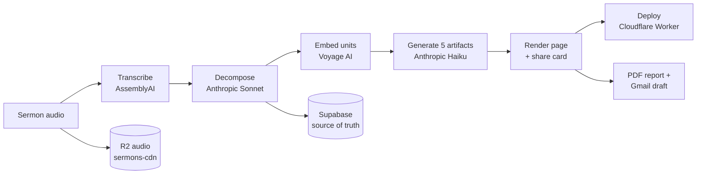

# Sermon Steward — Pipeline Operations & Architecture

> **What this is.** The end-to-end system that turns a preached sermon (audio) into a
> hosted, decomposed, resource-rich sermon page on **sermonsteward.com**, plus the
> pastoral reports and congregant resources that go with it. This document is the
> single reference for the concept, the services it connects, where credentials
> live, how sermons get ingested, and how to operate/troubleshoot it.
>
> **Security note.** This repository is public. **No secret values live in the
> repo** — all keys are in a git-ignored `.env` (locally) or in Cloudflare Worker
> secrets. This document names keys but never prints their values. The only
> Supabase key that appears in committed client code is the **anon** key, which is
> designed to be public (it is protected by row-level security).

---

## 1. Concept

**Shepherd's Guild** and **Sermon Steward** are sibling products:

- **Sermon Steward** — sermon *hosting* for local churches: a clean, fast, AI-friendly
  page for every sermon (transcript, audio, structured analysis, congregant
  resources, share cards, podcast-ready feeds). Lives at `sermonsteward.com`.
- **Shepherd's Guild** — the preaching-*coaching* layer (canonical "Hall of preachers"
  comparisons, illustration/citation libraries). Lives at `theshepherdsguild.com`.

The **pipeline** in this repo is the engine behind both: it *decomposes* a sermon
transcript into a rich, queryable structure (units, theses, doctrinal loci,
citations, quotations, biblical-theological moves) and drives everything
downstream from that.

The core insight: once a sermon is decomposed, you can do far more than host it —
search it by meaning, generate congregant resources, write in the pastor's voice,
compare it to master preachers, and synthesize across a whole series.

---

## 2. The 30,000-foot flow



Every stage writes to **Supabase** (the source of truth). Audio is hosted on
**Cloudflare R2**. The published site is a **Cloudflare Worker** serving static
assets.

---

## 3. Services & connections

| Service | Role | Where credentials live |
|---|---|---|
| **Supabase** (`twbunmbzyqcqzgffdrib`) | Postgres source of truth + edge functions | `.env` (`SUPABASE_URL`, service key); anon key is public-by-design |
| **Cloudflare Workers** | Serves `sermonsteward.com`; the upload worker; the self-serve worker | `wrangler` (OAuth login on the ops machine) + `wrangler secret put` |
| **Cloudflare R2** | Sermon audio hosting → `sermons-cdn.sermonsteward.com` | `.env` (`R2_*`) via boto3 |
| **AssemblyAI** | Speech-to-text transcription | `.env` (`ASSEMBLYAI_API_KEY`) |
| **Anthropic** | Decomposition (Sonnet), artifacts (Haiku), reports | `.env` (`ANTHROPIC_API_KEY`) |
| **Voyage AI** | Unit embeddings (`voyage-3.5`, 1024-dim) for semantic search | `.env` (`VOYAGE_API_KEY`) |
| **Resend** | Transactional email (self-serve reports) | `.env` (`RESEND_API_KEY`, `RESEND_FROM`) |
| **Gmail** (via MCP) | Drafting per-sermon report emails to churches | Operator's Google account (not stored in repo) |

**Sites & domains**
- `sermonsteward.com` — the hosted sermon site (Cloudflare Worker, static `_site`).
- `sermons-cdn.sermonsteward.com` — R2 bucket public base (audio + share-card PNGs).
- `upload.sermonsteward.com` — the church tech-upload worker.
- `try.sermonsteward.com` — the public self-serve "drop an MP3, get a report" worker.
- `sermons.sovgracekc.org` — the upstream host (Nucleus) that Providence syncs *from*.

---

## 4. Secrets & API keys — where they live

**Never committed.** Local secrets live in **`.env` at the repo root**, which is
git-ignored (see `.gitignore`). Use **`env.template`** as the starting point.

Keys used by the pipeline (names only):

```
# LLM / embeddings / transcription
ANTHROPIC_API_KEY          # decomposition (Sonnet), artifacts (Haiku), reports
VOYAGE_API_KEY             # unit embeddings
ASSEMBLYAI_API_KEY         # transcription

# Supabase
SUPABASE_URL               # project URL
SUPABASE_KEY / SUPABASE_SERVICE_ROLE_KEY   # service-role key for writes
# (the anon key is separate and public-by-design, used in client dashboards)

# Cloudflare R2 (audio hosting via boto3)
R2_ACCOUNT_ID
R2_ACCESS_KEY_ID
R2_SECRET_ACCESS_KEY
R2_BUCKET                  # sermon-steward-audio
R2_PUBLIC_BASE             # https://sermons-cdn.sermonsteward.com

# Email (self-serve)
RESEND_API_KEY
RESEND_FROM                # e.g. "Sermon Steward <reports@sermonsteward.com>"
```

**Cloudflare Worker secrets** are *not* in `.env`; they are set on each Worker with
`wrangler secret put <NAME>` (e.g. `SUPABASE_SERVICE_KEY` on the upload/self-serve
workers). The `wrangler.jsonc` / `wrangler.toml` files hold only non-secret vars
and bindings.

The **self-serve Worker** (`sermon-steward-try` at `try.sermonsteward.com`) also
needs the same R2 API token already used on the iMac (names only — paste values
from `.env`, never print them):

```
cd web/selfserve-worker
npx wrangler secret put SUPABASE_SERVICE_KEY
npx wrangler secret put R2_ACCOUNT_ID
npx wrangler secret put R2_ACCESS_KEY_ID
npx wrangler secret put R2_SECRET_ACCESS_KEY
```

Those three `R2_*` secrets mint the presigned PUT. After they are set, apply
bucket CORS so the browser may PUT from `https://try.sermonsteward.com`
(list first so you do not wipe an existing policy):

```
npx wrangler r2 bucket cors list sermon-steward-audio
npx wrangler r2 bucket cors set sermon-steward-audio --file cors.json
npx wrangler deploy
```

**Fresh-machine setup checklist**
1. `git clone` this repo.
2. `cp env.template .env` and fill in the real values (from your password manager).
3. `pip install -r requirements.txt` (anthropic, voyageai, supabase, boto3,
   python-dotenv, playwright, httpx …) and `playwright install chromium`.
4. `wrangler login` (for deploys) on the Cloudflare account `chris@sovgracekc.org`.
5. Copy the `launchd/*.plist` cron jobs to `~/Library/LaunchAgents/` and
   `launchctl load -w` them (see §7).

---

## 5. Data model (Supabase)

| Table | What it holds |
|---|---|
| `sermons` | One row per sermon: title, date, `primary_text`, `series_name`, thesis, abstract, `slug`, `audio_url`/`hosted_audio_url`, `podcast_guid`, `upload_source`, `decomposed_at`, `last_rendered_at`, token/cost tracking |
| `units` | The decomposed segments of a sermon (rhetorical function, key claim, doctrinal loci, embedding) |
| `citations` | 3-tier: primary text, cross-references, and (tier 3) human quotations — FK to `units` |
| `quotations`, `bt_moves`, `illustration_rewrites` | Quotations, biblical-theological moves, and the Chris-only illustration rewrite layer — FK to `units` |
| `sermon_artifacts` | The 5 congregant resources per sermon (see §6) |
| `preachers`, `churches` | Preacher and church records; `churches.url_slug` maps to the deploy directory; `churches.upload_token` gates the upload worker |
| `mcp_tokens` | Per-pastor bearer tokens for the "talk to your corpus" MCP connector |
| `self_serve_jobs` | Public self-serve upload jobs (try.sermonsteward.com) |

`upload_source` values: `host_sync` (auto-pulled), `tech_upload` (upload tool),
`self_serve` (public CTA).

---

## 6. Ingest procedures

### Intake paths (how a sermon enters the system)

1. **`host_sync` — Providence Community Church (Chris Oswald).**
   `sync_sermons_from_nucleus.py` pulls new sermons from `sermons.sovgracekc.org`
   (a Nucleus platform), creating/updating the `sermons` row with audio +
   transcript + `podcast_guid`. Deduped by `podcast_guid` (a
   `https://sermons.sovgracekc.org/sermons/<id>/` URL — matched **globally**, so a
   guest sermon under the correct preacher won't re-duplicate if it carries the
   guid). Runs inside the **weekly/catchup** crons.

2. **`tech_upload` — Cross of Grace Church (Ricky Alcantar, El Paso).**
   A church tech uploads the MP3 + metadata at `upload.sermonsteward.com`
   (`web/upload-worker/`). Creates the `sermons` row + streams audio to R2.
   Processed by the **cogwatch** cron.

3. **`self_serve` — public CTA.** A pastor uploads at `try.sermonsteward.com`
   (`web/selfserve-worker/`). The browser sends the MP3 **directly to R2** with
   a short-lived presigned PUT (Cloudflare Free/Pro Workers reject bodies over
   100 MB with HTTP 413, so the file must not go through the Worker). The
   Worker then inserts a `self_serve_jobs` row (`status='pending'`, key
   `self-serve/<uuid>.mp3`) → `selfserve_poller.py` →
   `scripts/selfserve_ingest.py` → emails the report via Resend. **A git push
   does not publish this Worker** — deploy from `web/selfserve-worker/` with
   `npx wrangler deploy`.

### The pipeline stages (per sermon)

1. **Transcribe** — AssemblyAI, from the hosted audio URL (skipped if a transcript
   already exists).
2. **Decompose** — Anthropic **Sonnet** turns the transcript into the structured
   decomposition (title, date, primary text, series, thesis, abstract, units, loci,
   citations, quotations, BT moves). Spec: `sermon-decomposition-spec-v3.md`.
3. **Embed** — Voyage embeds each unit for semantic search.
4. **Artifacts** — Anthropic **Haiku** generates the **5 congregant resources**:
   `small_group_questions`, `daily_readings`, `family_card`, `couples_guide`,
   `memory_verse`. (The old `prayer_prompt` was dropped.)
5. **Render** — `generate_sermon_pages.py render <id>` builds the sermon page and
   the 1200×630 **Open Graph share card** (`scripts/generate_og_card.py`).
6. **Deploy** — `scripts/deploy_sermon_pages.py` copies the page + card into the
   `sermon-steward` repo, rebuilds the church index/browse pages, commits, and runs
   `wrangler deploy` to publish (see §7).

### Automated schedules (launchd, America/Chicago)

| Job (plist) | When | What it runs |
|---|---|---|
| **weekly** | Sun 7:00 PM | `weekly_ingest.py weekly` — discover + **submit** decompose batches |
| **catchup** | Mon 7:00 & 9:00 AM | `weekly_ingest.py weekly --catchup && weekly_ingest.py auto-process` — process Sunday's batches → artifacts → render → **deploy** (Providence path) |
| **cogwatch** | 4/6/8 PM daily | `scripts/watch_cog_and_process.py` — Cross of Grace end-to-end (transcribe → … → deploy). No-ops when nothing new |
| **selfserve** | every 5 min | `scripts/selfserve_poller.py` — process pending self-serve jobs |

Both automated paths deploy end-to-end. The artifact step **retries** each type up
to 3× with backoff (transient Postgres timeouts otherwise leave a sermon at 4/5).

### Decomposition: batch vs. synchronous

Decomposition currently goes through Anthropic's **Message Batches API** (50% cost,
"within 24h" best-effort). For one-sermon-at-a-time weekly work this occasionally
**stalls** (usually 5–15 min, sometimes 60–90 min). A **synchronous** decompose
(regular Messages API) is near-instant for ~$0.20 more per sermon. See §9 for the
manual synchronous force. (Switching the per-sermon path to synchronous is a small,
recommended change; batch remains ideal for any future bulk re-import.)

---

## 7. Deploy — how sermonsteward.com actually publishes

`sermonsteward.com` is a **Cloudflare Worker** (`coswald75/sermon-steward`,
`worker.js`) that serves **static assets from `_site`**. Build = eleventy
(`npm run build`, `_src` → `_site`, passthrough-copies the church dirs like
`ProvidenceLenexa`, `CoGElPaso`).

- **A `git push` does NOT deploy.** The Cloudflare git-CI is unreliable. Publishing
  happens via `npm run build && npx wrangler deploy`, which
  `scripts/deploy_sermon_pages.py` runs for you after copying pages + rebuilding
  indexes.
- Standard command: `python scripts/deploy_sermon_pages.py --sermon-ids <id[,id]>`
  (`--no-deploy` for git-only).
- **Clean-tree requirement:** the deploy refuses to run on a dirty `sermon-steward`
  working tree. Indexes are only rebuilt when a page is actually copied (so stray
  regenerated index files don't accumulate); `.DS_Store` is git-ignored.
- **Edge cache:** a just-deployed, previously-visited URL may serve a stale copy for
  ~1 min (`cf-cache-status: HIT`, self-clears). New URLs publish instantly.

---

## 8. Reports & drafts

- **Per-sermon PDF report** — `scripts/generate_sermon_report.py <id>` →
  `output/reports/<church-slug>/<slug>.pdf`. Sections: summary, "what we noticed,"
  writing prompts, a **sample article in the preacher's own voice** (voice guides:
  `chris-voice-style-guide.md`, `ricky-voice-style-guide.md`), and the congregant
  resources. Generated on demand.
- **Gmail draft** — after generating the PDF, a report email is drafted to the
  church (e.g. Cross of Grace → `ricky@` + `janel@crossofgrace.net`). The operator
  attaches the PDF and sends. Reports/drafts are a **manual** step, not automated.
- **Series capstone report** — `scripts/generate_series_report.py` synthesizes
  *across* all sermons in a completed series (arc, throughline themes, chorus of
  preachers, sermon-by-sermon, and a full **series article** in the lead pastor's
  voice), rendered as a branded PDF. First pilot: Cross of Grace's "Living Life
  Backwards — A Journey Through Ecclesiastes." The pipeline flags a series finale
  via `series_position`.

---

## 9. Runbook — common operations

**Deploy the public try. form** (`try.sermonsteward.com`). Git push does **not**
publish this Worker. From `web/selfserve-worker/`, after any R2 secrets / CORS
are already set:

```bash
npx wrangler deploy
```

**Process one Cross of Grace sermon now** (instead of waiting for cogwatch):
```bash
python scripts/watch_cog_and_process.py
```

**Process / re-render / deploy a single sermon by id:**
```bash
python generate_artifacts.py generate <id> --type <artifact_type>   # one artifact
python generate_sermon_pages.py render <id>                          # render + card
python scripts/deploy_sermon_pages.py --sermon-ids <id>              # publish
```

**Force a stuck decomposition batch through synchronously** (when Anthropic's batch
queue stalls): stop the waiting cron process, **cancel** the batch
(`anthropic.messages.batches.cancel(<batch_id>)`), then decompose synchronously and
attach to the **existing** row via `pipeline_batch.ingest_sermon(...,
existing_sermon_id=<uuid>)` (this UPDATEs in place — clears/reinserts units, keeps
slug/audio/preacher — so **no duplicate row**), then artifacts → render → deploy.

**Backfill a missing artifact:**
```bash
python generate_artifacts.py generate <id> --type <missing_type>
python generate_sermon_pages.py render <id> && \
python scripts/deploy_sermon_pages.py --sermon-ids <id>
```

**Remove a duplicate sermon** (e.g. a manual ingest + a later `host_sync` copy):
keep the correct-preacher row, delete the other (`units`/`artifacts` cascade;
delete `illustration_rewrites` first — that FK is `NO ACTION`), and **transplant the
sync `podcast_guid`** onto the kept row so `host_sync` matches it globally and won't
re-duplicate. Then rebuild indexes + deploy.

**Generate a report + draft** for a sermon: `generate_sermon_report.py <id>`, then
draft the email (operator attaches the PDF).

**Generate a series report:** `python scripts/generate_series_report.py` (edit the
`SERIES` config for a new series).

---

## 10. Known gotchas

- **Batch slowness** — Anthropic batches occasionally stall 60–90 min; force
  synchronously (§9). Consider switching the per-sermon path to synchronous.
- **Artifact timeouts** — transient Postgres `57014` timeouts; the pipeline retries
  3× with backoff. If a sermon lands at 4/5, backfill (§9).
- **Edge cache** — stale `HIT` for ~1 min after redeploy; cache-bust with a query
  string to hit the origin.
- **`host_sync` duplicates** — a guest sermon manually ingested under the real
  preacher can be re-created by `host_sync` under the default preacher (same slug).
  Fix via the guid transplant (§9).
- **Deploy dirty-tree** — the deploy refuses on a dirty `sermon-steward` tree;
  indexes rebuild only when a page is copied.
- **Anon key + RLS** — the public anon key is only safe while row-level security is
  correctly enforced on Supabase tables. Worth periodic review.

---

## 11. Repo layout (key files)

| Path | Purpose |
|---|---|
| `pipeline.py` | Core synchronous decompose → embed → ingest |
| `pipeline_batch.py` | Batch decompose (submit/process) + `ingest_sermon(existing_sermon_id=…)` |
| `weekly_ingest.py` | Weekly/catchup orchestrator (submit, process, artifacts, render, **deploy**) |
| `scripts/watch_cog_and_process.py` | Cross of Grace end-to-end watcher (cogwatch) |
| `sync_sermons_from_nucleus.py` | `host_sync` puller (Providence) |
| `generate_sermon_pages.py` | Render a sermon page (+ share card) |
| `scripts/generate_og_card.py` | 1200×630 Open Graph share card |
| `scripts/build_church_indexes.py` | Church index + scripture/doctrine/series browse pages |
| `scripts/deploy_sermon_pages.py` | Copy → rebuild indexes → commit → `wrangler deploy` |
| `generate_artifacts.py` | Generate one congregant-resource artifact |
| `scripts/generate_sermon_report.py` | Per-sermon PDF report |
| `scripts/generate_series_report.py` | Series capstone report |
| `scripts/selfserve_ingest.py`, `selfserve_poller.py` | Self-serve CTA engine |
| `web/upload-worker/`, `web/selfserve-worker/` | Cloudflare upload + self-serve workers |
| `launchd/*.plist` | The four cron jobs (weekly, catchup, cogwatch, selfserve) |
| `sermon-decomposition-spec-v3.md` | The decomposition spec (LLM system prompt) |
| `env.template` | Template for the git-ignored `.env` |

---

*Generated as the living operations reference for the Sermon Steward pipeline. Keep
it current as procedures change.*
